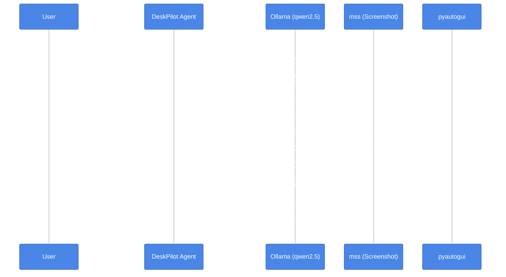

<picture>
  <source media="(prefers-color-scheme: dark)" srcset="docs/logo-dark.svg">
  <source media="(prefers-color-scheme: light)" srcset="docs/logo-light.svg">
  
</picture>

# DeskPilot

**Pilot Any Desktop. Automate Any Application. No API Required.**

<p align="center">
  
  
  
  
  
</p>

> **Note:** This project is a **proof of concept** and is not production-ready. It demonstrates the capabilities of AI-powered desktop automation but may have limitations, bugs, or incomplete features. Use at your own risk.

---

## What is DeskPilot?

DeskPilot transforms any computer into an AI-powered automation platform. It uses local AI models (via Ollama) to understand natural language commands and control desktop applications through screen capture and input simulation.

**Key Features:**
- **100% Local** - All AI processing happens on your machine, no cloud required
- **Natural Language** - Control apps with commands like "Open Calculator and compute 15 * 8"
- **Universal** - Works with any application that has a GUI
- **Air-Gapped Ready** - Fully offline capable after initial setup

---

## Architecture

DeskPilot runs **directly on your machine** and controls applications natively:

```mermaid
%%{init: {'theme': 'neutral', 'themeVariables': { 'primaryColor': '#4a86e8', 'primaryTextColor': '#fff', 'primaryBorderColor': '#2d5aa3', 'lineColor': '#6c757d', 'secondaryColor': '#f8f9fa', 'tertiaryColor': '#e9ecef'}}}%%
flowchart TB
    subgraph computer["Your Computer"]
        subgraph ui["User Interface"]
            tui["OpenClaw TUI / DeskPilot CLI<br/>> Open Calculator and compute 15 * 8"]
        end

        subgraph core["Core Components"]
            agent["DeskPilot<br/>Agent"]
            ollama["Ollama AI<br/>(qwen2.5)"]
            native["pyautogui<br/>+ mss"]
        end

        subgraph apps["Desktop Applications"]
            calc["Calculator, Notepad, Browser...<br/>(any GUI application)"]
        end

        tui --> agent
        agent <--> ollama
        agent --> native
        native --> calc
    end

    style computer fill:#1a1a2e,stroke:#4a86e8,stroke-width:2px
    style ui fill:#16213e,stroke:#4a86e8
    style core fill:#0f3460,stroke:#4a86e8
    style apps fill:#1a1a2e,stroke:#4a86e8
    style tui fill:#4a86e8,stroke:#2d5aa3,color:#fff
    style agent fill:#4a86e8,stroke:#2d5aa3,color:#fff
    style ollama fill:#00aa55,stroke:#007a3d,color:#fff
    style native fill:#ff6600,stroke:#cc5200,color:#fff
    style calc fill:#6c757d,stroke:#495057,color:#fff
```



For demos, we also provide a Docker image with a self-contained Windows VM.

---

## Quick Start

### Option 1: Try the Demo (Docker)

The fastest way to see DeskPilot in action:

```bash
# Clone the repo
git clone https://github.com/usathyan/deskpilot && cd deskpilot

# Start the demo container (Windows VM with everything pre-installed)
docker-compose up -d

# Open your browser to see the Windows desktop
open http://localhost:8006
```

The OpenClaw TUI will be running. Try typing:
- `Open Calculator and compute 15 * 8`
- `Take a screenshot`

### Option 2: Native Installation

Install DeskPilot on your own machine:

```bash
# Clone and install
git clone https://github.com/usathyan/deskpilot && cd deskpilot
make venv && source .venv/bin/activate
make install

# Run the installer (sets up Ollama, OpenClaw, etc.)
deskpilot install

# Check everything is ready
deskpilot status

# Run the demo
deskpilot demo
```

Or use the one-liner:

```bash
# macOS/Linux
curl -fsSL https://raw.githubusercontent.com/usathyan/deskpilot/main/scripts/install.sh | bash

# Windows (PowerShell)
irm https://raw.githubusercontent.com/usathyan/deskpilot/main/scripts/install.ps1 | iex
```

---

## Usage

### Interactive TUI

Launch the OpenClaw TUI for interactive control:

```bash
deskpilot tui
# or
openclaw dashboard
```

Then type natural language commands:
```
> Open Calculator
> Click the 7 button, then multiply, then 8, then equals
> What is on screen?
```

### CLI Commands

```bash
# Take a screenshot
deskpilot screenshot --save

# Click at coordinates
deskpilot click 500 300

# Type text
deskpilot type "Hello, World!"

# Launch an app
deskpilot launch Calculator

# Press keys
deskpilot press enter
deskpilot hotkey ctrl c

# Run an AI task
deskpilot run "Open Calculator and compute 15 * 8"
```

### Configuration

View current settings:
```bash
deskpilot config
```

Override settings in `config/local.yaml`:
```yaml
model:
  provider: ollama
  name: qwen2.5:3b

agent:
  max_steps: 50
  verbose: true
```

---

## Agent Personalization

DeskPilot uses a multi-file configuration pattern for personalized automation. Each file serves a specific purpose:

```mermaid
%%{init: {'theme': 'dark'}}%%
flowchart TB
    subgraph config["~/.openclaw/skills/computer-use/"]
        skill["SKILL.md<br/>Commands & Capabilities"]
        soul["SOUL.md<br/>Agent Personality"]
        user["USER.md<br/>Your Context"]
        memory["MEMORY.md<br/>Persistent Knowledge"]
        heartbeat["HEARTBEAT.md<br/>Proactive Monitoring"]
        cron["CRON.md<br/>Scheduled Tasks"]
    end

    skill --> |"what I can do"| agent["DeskPilot Agent"]
    soul --> |"how to communicate"| agent
    user --> |"who am I helping"| agent
    memory --> |"what I remember"| agent
    heartbeat --> |"what to monitor"| agent
    cron --> |"when to act"| agent

    style skill fill:#e91e63,stroke:#c2185b,color:#fff
    style soul fill:#4a86e8,stroke:#2d5aa3,color:#fff
    style user fill:#ff6600,stroke:#cc5200,color:#fff
    style memory fill:#00aa55,stroke:#007a3d,color:#fff
    style heartbeat fill:#9c27b0,stroke:#7b1fa2,color:#fff
    style cron fill:#795548,stroke:#5d4037,color:#fff
    style agent fill:#1a1a2e,stroke:#4a86e8,color:#fff
    style config fill:#0f3460,stroke:#4a86e8
```



### File Roles

| File | Role | Description |
|------|------|-------------|
| **SKILL.md** | Capabilities | Defines commands, tools, and what the agent can do |
| **SOUL.md** | Personality | How the agent communicates, tone, boundaries |
| **USER.md** | Context | Who you are, your workflows, preferences |
| **MEMORY.md** | Knowledge | Corrections, learnings, session history |
| **HEARTBEAT.md** | Monitoring | Proactive checks and alerts |
| **CRON.md** | Scheduling | Automated tasks at specific times |

### Essential: Configure USER.md

The most important step after installation is filling in `USER.md`. The more context you provide, the more relevant and efficient the automation becomes.

```bash
# Open USER.md for editing
# macOS/Linux
nano ~/.openclaw/skills/computer-use/USER.md

# Windows
notepad %USERPROFILE%\.openclaw\skills\computer-use\USER.md
```

**Include:**
- Your role and responsibilities
- Current projects and priorities
- Primary applications you use daily
- Common workflows that could be automated
- Communication preferences (technical vs. conversational)
- Boundaries (sensitive apps, off-limits areas)

> **Tip:** Use voice transcription to quickly describe your workflows. Talk for 10-15 minutes about how you work, then paste the transcript into USER.md.

### Update Frequency

| File | When to Update |
|------|----------------|
| **SKILL.md** | When adding new commands or capabilities |
| **USER.md** | Weekly (as priorities shift) |
| **SOUL.md** | Rarely (only if tone/style is wrong) |
| **MEMORY.md** | Automatic + weekly cleanup |
| **HEARTBEAT.md** | As monitoring needs change |
| **CRON.md** | As scheduled tasks evolve |

### Example: Developer Setup

**USER.md snippet:**
```markdown
# Basic Info
Name: Alex
Timezone: America/Los_Angeles
OS: macOS Sonoma

# Work Context
Role: Backend Engineer
Projects:
  - [HIGH] API migration - due Feb 15
  - [MEDIUM] Code review backlog

# Primary Apps
- VS Code (Python, Docker extensions)
- Chrome (GitHub, Jira, Slack web)
- Terminal (zsh, kubectl)

# Preferences
Communication: Technical, precise
Confirmations: Only for destructive actions
```

**CRON.md snippet:**
```yaml
task: morning_startup
schedule: "0 9 * * 1-5"  # 9 AM weekdays
actions:
  - launch: "VS Code"
  - launch: "Chrome"
  - execute: "open https://jira.company.com/board"
```

---

## Requirements

| Component | Minimum | Recommended |
|-----------|---------|-------------|
| **CPU** | 4 cores @ 2.5 GHz | 8+ cores @ 3.0 GHz |
| **RAM** | 8 GB | 16 GB |
| **Storage** | 5 GB | 10 GB SSD |
| **Python** | 3.11+ | 3.12+ |
| **GPU** | **Not required** | Optional (faster) |

**Runs on:** Intel i5+, AMD Ryzen 5+, Apple M1+

---

## How It Works



**Loop continues until task is complete or max steps reached.**

---

## Project Structure

```
deskpilot/
├── src/deskpilot/
│   ├── cli.py              # CLI commands
│   ├── installer/          # Native installer
│   ├── cua_bridge/         # Computer control layer
│   │   ├── computer.py     # NativeComputer, MockComputer
│   │   ├── actions.py      # High-level actions
│   │   └── agent.py        # AI agent
│   ├── wizard/
│   │   ├── config.py       # Configuration management
│   │   ├── setup.py        # Status checking
│   │   └── demo.py         # Calculator demo
│   └── openclaw_skill/     # OpenClaw integration
├── config/
│   └── default.yaml        # Default configuration
├── docker/
│   ├── Dockerfile.demo     # Demo container
│   └── setup-demo.ps1      # Windows setup script
├── scripts/
│   ├── install.sh          # macOS/Linux installer
│   └── install.ps1         # Windows installer
└── tests/                  # Test suite
```

---

## Development

```bash
# Create virtual environment
make venv
source .venv/bin/activate

# Install dev dependencies
make install

# Run tests
make test

# Run linter
make lint

# Format code
make format
```

---

## Limitations (Proof of Concept)

- **AI Accuracy**: The AI may misinterpret screens or make incorrect clicks
- **Speed**: Local AI inference is slower than cloud APIs
- **Reliability**: Complex multi-step tasks may fail partway through
- **Platform Support**: Best tested on Windows; macOS/Linux may have issues
- **Security**: Requires screen capture and input permissions

---

## Roadmap

- [x] Core automation engine
- [x] Multi-platform support
- [x] Calculator demo
- [x] Native installer
- [x] Docker demo environment
- [ ] Improved AI accuracy
- [ ] Skill marketplace
- [ ] Visual skill builder
- [ ] Scheduled triggers

---

## License

MIT License - Free for commercial and personal use.

---

<p align="center">
  <b>DeskPilot: Because every desktop deserves an AI co-pilot.</b>
  <br><br>
  <a href="#quick-start">Get Started</a> ·
  <a href="#usage">Usage</a> ·
  <a href="https://github.com/usathyan/deskpilot/discussions">Community</a>
</p>
